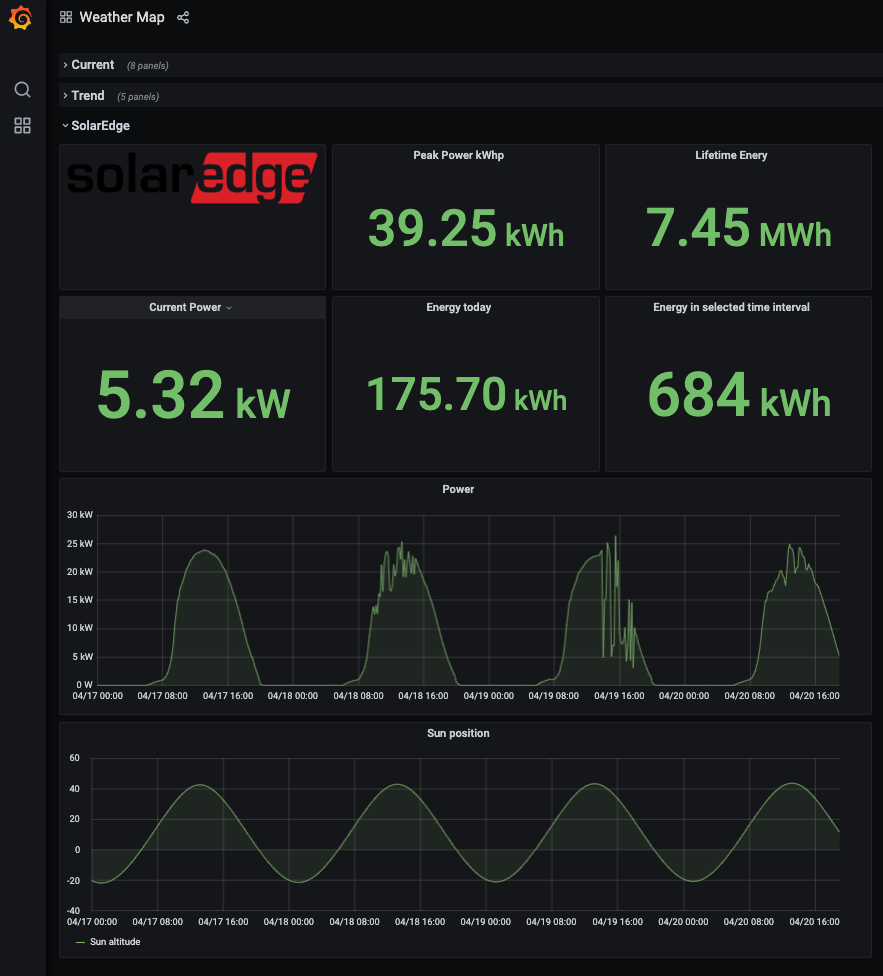

# Balena Weather Station

A Raspberry Pi based weather station, running a [extensible](#extending-the-balena-weather-station) Balena [multi-container application](https://www.balena.io/docs/learn/develop/multicontainer/) inspired by the [Raspberry Pi weather station](https://projects.raspberrypi.org/en/projects/build-your-own-weather-station/0) project.


The following sections describe the hardware, wiring and configuration of the Balena Weather Station.

<!-- MarkdownTOC levels="2,3,4" autolink="true" indent="  " -->

- [Balena Weather Station](#balena-weather-station)
  - [Hardware](#hardware)
    - [Wiring](#wiring)
  - [Deploy the code](#deploy-the-code)
    - [Via Deploy with Balena](#via-deploy-with-balena)
    - [Via the `balena` CLI](#via-the-balena-cli)
  - [Configure the Balena Weather Station](#configure-the-balena-weather-station)
    - [DT parameters and overlays](#dt-parameters-and-overlays)
    - [Device Variables](#device-variables)
    - [Access to the Grafana interface](#access-to-the-grafana-interface)
  - [Individual service descriptions](#individual-service-descriptions)
    - [Sensors](#sensors)
    - [MQTT, Telegraf and InfluxDB](#mqtt-telegraf-and-influxdb)
    - [UI and API](#ui-and-api)
  - [Powering the Raspberry Pi via the 5V rail](#powering-the-raspberry-pi-via-the-5v-rail)
  - [Extending the Balena Weather Station](#extending-the-balena-weather-station)
  - [Contributing](#contributing)
  - [Troubleshooting](#troubleshooting)

<!-- /MarkdownTOC -->

## Hardware


Let's start with the hardware used for this project.

- 1 [Raspberry Pi 3](https://www.raspberrypi.com/products/raspberry-pi-3-model-b/) - the heart of the weather station.
    Balena Weather Station is also compatible with the Raspberry Pi 4.
- 1 [Sparkfun Weather Meter Kit](https://www.sparkfun.com/products/15901) - the main weather station components, including an anemometer, wind vane and rain gauge.
- 1 [Prototyping HAT for Raspberry Pi](https://www.robotshop.com/en/prototyping-hat-raspberry-pi-b-2ba3b.html) - I aimed to build a permanent weather station (see picture above). For this reason, I opted for the Prototyping HAT and soldering.
    You can also use a [GPIO extender board](https://www.sparkfun.com/products/13717) with a breadboard for a less permanent solution.
- 1 [MCP3008](https://www.microchip.com/en-us/product/MCP3008) - a 8-channel, 10-bit ADC with SPI interface.
    It is used to convert the analog voltage provided by the wind vane into a digital value.
- 1 [SHT-30](https://www.adafruit.com/product/4099) - a wheater proof humidity sensor that includes a temperature sensor.
    The temperature measurements by the SHT-30 are also stored in InfluxDB.
    However, the default Grafana dashboard does not include them.
- 1 [DS18B20](https://www.amazon.com/Eiechip-Waterproof-Temperature-Thermometer-Resistance/dp/B07MB1J43W/) - standard 1-wire bus waterproof temperature sensor.
- 2 4.7k&#8486; resistors - used for the wind vane's voltage divider circuit as well as a pull-up resistor for the temperature sensor.
- 1 [Raspberry Pi IP54 Outdoor Project Enclosure](https://sixfab.com/product/raspberry-pi-ip54-outdoor-iot-project-enclosure/) - a weatherproof enclosure for the Raspberry Pi.

### Wiring

The following diagram provides the schematics of the Balena Weather Station.
The anemometer, wind vane and rain gauge are symbolised by their main electric component.

**NOTE**: The Sparkfun Weather station comes per default with 6-pin RJ11 connectors.
The middle four pins are connected, but only two cables are used.
Refer to the [Sparkfun Weather Meter Kit manual](https://cdn.sparkfun.com/assets/d/1/e/0/6/DS-15901-Weather_Meter.pdf) to see which cables are relevant for each of the components.


## Deploy the code

### Via [Deploy with Balena](https://www.balena.io/docs/learn/deploy/deploy-with-balena-button/)

Running this project is as simple as deploying it to a balenaCloud application.
You can do it in just one click by using the button below:

[](https://dashboard.balena-cloud.com/deploy?repoUrl=https://github.com/hferentschik/balena-weather)

Follow instructions, click Add a Device and flash an SD card with that OS image downloaded from balenaCloud.
Enjoy the magic 🌟Over-The-Air🌟!

### Via the `balena` [CLI](https://www.balena.io/docs/reference/balena-cli/)

If you would like to add more services, get the `balena` CLI and follow these steps:

- Sign up on [balena.io](https://dashboard.balena.io/signup)
- Create a new application on balenaCloud.
- Clone this repository to your local workspace.
- Using the `balena` [CLI](https://www.balena.io/docs/reference/cli/), push the code with `balena push <application-name>`
- See the magic happening; your device is getting updated 🌟Over-The-Air🌟!

## Configure the Balena Weather Station

On the software side, the Balena Weather Station is built as a [multi container application](https://www.balena.io/docs/learn/develop/multicontainer/).
Services are defined in [docker-compose.yml](./docker-compose.yml).


### DT parameters and overlays

For the sensors to work, the Balena [device or fleet configuration](https://github.com/balena-io/balena-fleet-management-masterclass#3-configuration) needs to enable the _w1-gpio_ overlay as well as set the DT parameters _"i2c_arm=on","spi=on"_.


### Device Variables

The following Device Variables are supported by the  Balena Weather Station:


Variable Name | Value | Description | Default
------------ | ------------- | ------------- | -------------
**`SAMPLE_RATE`** | `INT` | The default sample rate for each container is 15 minutes (specified in seconds). | 900
**`MQTT_USER`** | `STRING` | Username to authenticate with the MQTT message broker |
**`MQTT_PASSWORD`** | `STRING` | Password to authenticate with the MQTT message broker |
**`LATITUDE`** | `FLOAT` | Specify your `LATITUDE` for the `api` service that calculates sunrise and sunset |
**`LONGITUDE`** | `FLOAT` | Specify your `LONGITUDE` for the `api` service that calculates sunrise and sunset |
**`TIMEZONE`** | `STRING` | Defines your timezone to calculate the time of your sunrise and sunset |

### Access to the Grafana interface

Once all the services are successfully deployed, you will be able to access the Weather Station Grafana interface using the local device address  `http://<local-ip-address>/weather` or the Balena public address `http://<public-ip-address>/weather` respectively.

**TIP**: Assuming your fleet is called _weather_, you can retrieve the public URL using:

```sh
balena device public-url $(balena devices -a weather --json | jq -r .[].id)
```


## Individual service descriptions

The following sections describe the various services in more detail.

### Sensors

Each service is contained in its own subdirectory.
The README in each subdirectory provides additional information for each service.

- [Anemometer](./anemometer/README.md) - Anemometer (wind speed) sensor of the weather station.
- [Humidity](./humidity/README.md) - Humidity and temperature sensor SHT-30.
- [Raingauge](./raingauge/README.md) - Raingauge sensor of the weather station.
- [Temperature](/temperature/README.md) - Additional DS18B20 temperature sensor.
  I am using an additonal temperetature sensor to the SHT-30 temperature sensor which I place in the shade.
  The SHT-30 on the other hand is in direct sunlight.
- [Windvane](/windvane/README.md) - Windvane sensor of the weather station.

### MQTT, Telegraf and InfluxDB

- [MQTT](./mqtt/README.md) - [Eclipse Mosquitto](https://hub.docker.com/r/arm64v8/eclipse-mosquitto) container which acts as message broker to which all sensors are sending their data.
  The Telegraf container reads from the Mosquitto queue and pushes the metrics into InfluxDB.
- [Telegraf](./telegraf/README.md) - Part of the [TIG](https://hackmd.io/@lnu-iot/tig-stack) stack to consume and display sensor data.
- InfluxDB - Time series database storing the sensor data.
  This is the storage component of the [TIG](https://hackmd.io/@lnu-iot/tig-stack) stack.
  It uses a default [InfluxDB DockerHub image](https://hub.docker.com/_/influxdb).

### UI and API

- [NGINX](./nginx) - NGINX listening on port 80 and acting as reverse proxy.
- [API](./api/README.md) - A Ruby based [Sinatra](http://sinatrarb.com) app used for exposing REST APIs for Grafana (using the JSON datasource plugin).
- [Grafana Dashboard](./dashboard/README.md) - the Grafana dashboard displaying all data.

## Powering the Raspberry Pi via the 5V rail

I decided to power the Raspberry Pi via the 5V power rail.
The following links provide information on how to do so.

- [Raspberry Pi Fuse](https://www.petervis.com/Raspberry_PI/Raspberry_Pi_Dead/Raspberry_Pi_Fuse.html)
- [Power requirements of the Pi](https://raspberrypi.stackexchange.com/questions/51615/raspberry-pi-power-limitations)

## Extending the Balena Weather Station

The [balena-weather](https://github.com/hferentschik/balena-weather) GitHub repo contains a [_solar_](https://github.com/hferentschik/balena-weather/tree/solar) branch with the required changes to add electricity production data for a SolarEdge solar panel installatio.



The data itself is provided by the [balena-solar-edge](https://github.com/hferentschik/balena-solar-edge) service.
_balena-solar-edge_ uses the [SolarEdge Monitoring Server API](https://www.solaredge.com/sites/default/files/se_monitoring_api.pdf) to retrieve the data and then pushes the data to MQTT.

The service can easily be added to [docker-compose.yml](./docker-compose.yml) like so:

```yaml
  solar:
    image: hferentschik/solar-edge:0.0.1
    restart: always
    depends_on:
     - mqtt
```

To keep the SolarEdge data seperate from the weather data, it gets stored into its own InfluxDB database.
To do this a new Telegraf configuration file (_solar-edge.conf_) gets added to the _/etc/telegraf/telegraf.d_ directory of the telegraf service.
The configuration follows the [Telegraf Best Practices](https://www.influxdata.com/blog/telegraf-best-practices/) in order to keep the configuration for the weather and solar part seperate.
In particular the use of _tagpass_ is important to ensure that only data from the _solar_ MQTT topic ges added to the _solar_ database.

```toml
###############################################################################
#                            OUTPUT PLUGINS                                   #
###############################################################################
[[outputs.influxdb]]
  alias = "influxdb_solar"
  timeout = "1s"
  database = "solar"
  urls = [ "http://influxdb:8086" ]
  [outputs.influxdb.tagpass]
    topic = [ "solar" ]

###############################################################################
#                            INPUT PLUGINS                                    #
###############################################################################
[[inputs.mqtt_consumer]]
  alias = "mqtt_solar"
  servers = [ "mqtt:1883" ]
  topics = [ "solar" ]
  json_name_key = "measurement"
  data_format = "json"
  json_time_key = "time"
  json_time_format = "2006-01-02T15:04:05"
  tag_keys = [
    "tags_name", "tags_image", "tags_model"
  ]
  # username = "mqtt"
  # password = "pass"
```

Last but not least, the Grafana dash needs to be updated to display the solar data.
The required changes are part of _dashboard.json_ in the dashboar service.

Using this approach other services can be added as well.

## Contributing

Contributions, questions, and comments are all welcomed and encouraged!

If you want to contribute, follow the [contribution guidelines](./CONTRIBUTING.md) when you open issues or submit pull requests.

## Troubleshooting

If you have any issues feel free to add a Github issue [here](https://github.com/hferentschik/balena-weather/issues) or add questions on the [balena forums](https://forums.balena.io).
