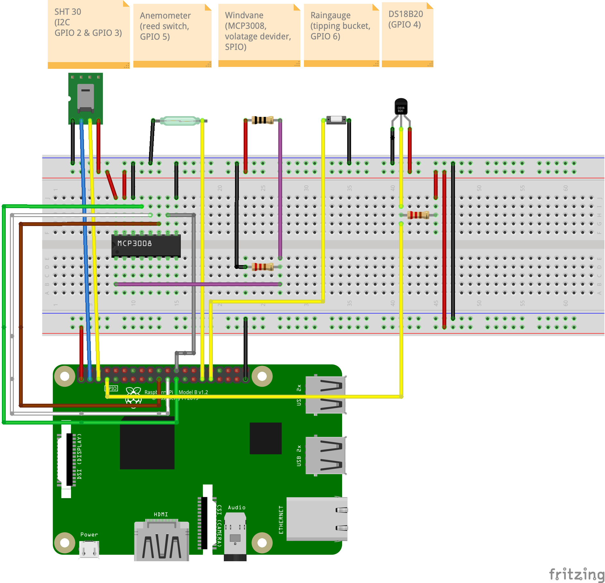
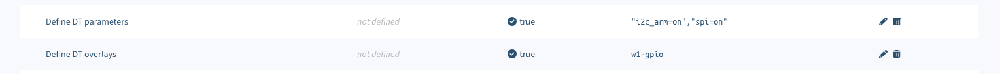
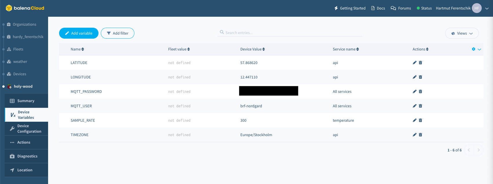

# Balena Weather Station

A Raspberry Pi weather station, running on a [Balena](https://www.balena.io/) multi-container application where you can add more services. This project is inspired by the [Raspberry Pi weather station](https://projects.raspberrypi.org/en/projects/build-your-own-weather-station/0).


The following sections describe the hardware, wiring and configuration of the Balena Weather Station.

## Hardware


Let's start with the hardware used for this project.

- 1 [Raspberry Pi 3](https://www.raspberrypi.com/products/raspberry-pi-3-model-b/) - the heart of the weather station.
    Balena Weather Station is also compatible with the Raspberry Pi 4.
- 1 [Sparkfun Weather Meter Kit](https://www.sparkfun.com/products/15901) - the main weather station components including anemometer, windvane and raingauge.
- 1 [Prototyping HAT for Raspberry Pi](https://www.robotshop.com/en/prototyping-hat-raspberry-pi-b-2ba3b.html) - my aim was to build a permanent weather station (see picture above). For this reason I opted for the Prototyping HAT and soldering the components together.
    You can also use a [GPIO extender board](https://www.sparkfun.com/products/13717) with a breadboard for a less permanent solution.
- 1 [MCP3008](https://www.microchip.com/en-us/product/MCP3008) - a 8-channel, 10-bit ADC with SPI interface.
    It is used to convert the analog voltage provided by the windvane's into a digital value.
- 1 [SHT-30](https://www.adafruit.com/product/4099) - a wheater proof humidity sensor which also includes a temperature sensor.
    The temperature measures by the SHT-30 is also stored in InfluxDB, however, the default Grafana dashboard does not include its value.
- 1 [DS18B20](https://www.amazon.com/Eiechip-Waterproof-Temperature-Thermometer-Resistance/dp/B07MB1J43W/) - standard 1-wire bus water proof temperature sensor.
- 2 4.7k&#8486; resistors - used for the vindvane's voltage divider circuit as well as a pull up resistor for the temperature sensor.
- 1 [Raspberry Pi IP54 Outdoor Project Enclosure](https://sixfab.com/product/raspberry-pi-ip54-outdoor-iot-project-enclosure/) - a weather proof enclosure for the Raspberry Pi.

The folling paragraph shows how the components are connected schematically.

### Wiring

The following diagram shows the schematics of Balena Weather.
The anemometer, windvane and raingauge are symbolised by their main electric component.

**NOTE**: The Sparkfun Weather station comes per default with RJ11 connectors which has 6 pins.
The middle four pins are connected, but only two cables are used.
Refer to the [Sparkfun Weather Meter Kit manual](https://cdn.sparkfun.com/assets/d/1/e/0/6/DS-15901-Weather_Meter.pdf) to see which cables are relevant for each of the components.



## Deploy the code

### Via [Deploy with Balena](https://www.balena.io/docs/learn/deploy/deploy-with-balena-button/)

Running this project is as simple as deploying it to a balenaCloud application. You can do it in just one click by using the button below:

[](https://dashboard.balena-cloud.com/deploy?repoUrl=https://github.com/hferentschik/balena-weather)

Follow instructions, click Add a Device and flash an SD card with that OS image dowloaded from balenaCloud. Enjoy the magic 🌟Over-The-Air🌟!

### Via [Balena-Cli](https://www.balena.io/docs/reference/balena-cli/)

If you would like to add more services get the balena CLI and follow next steps:

- Sign up on [balena.io](https://dashboard.balena.io/signup)
- Create a new application on balenaCloud.
- Clone this repository to your local workspace.
- Using [Balena CLI](https://www.balena.io/docs/reference/cli/), push the code with `balena push <application-name>`
- See the magic happening, your device is getting updated 🌟Over-The-Air🌟!

## Configure the Balena Weather Station

On the software side Balena Weather Station is built as a Balena [multi container application](https://www.balena.io/docs/learn/develop/multicontainer/).
The services comprising Balena Weather are defined in [docker-compose.yml](./docker-compose.yml).


### DT parameters and overlays

For the sensors to work, the Balena [device or fleet configuration](https://github.com/balena-io/balena-fleet-management-masterclass#3-configuration) needs to enable the _w1-gpio_ overlay as well as set the DT parameters _"i2c_arm=on","spi=on"_.



### Device Variables

Define your Device Variables to get some calculations done and configure your MQTT message broker.



Variable Name | Value | Description | Default
------------ | ------------- | ------------- | -------------
**`SAMPLE_RATE`** | `INT` | The default sample rate for each of the containers is 15 minutes (specified in seconds). | 900
**`MQTT_USER`** | `STRING` | Username to authenticate with the MQTT message broker |
**`MQTT_PASSWORD`** | `STRING` | Password to authenticate with the MQTT message broker |
**`LATITUDE`** | `FLOAT` | Specify your `LATITUDE` for the `api` service that calculates sunrise and sunset |
**`LONGITUDE`** | `FLOAT` | Specify your `LONGITUDE` for the `api` service that calculates sunrise and sunset |
**`TIMEZONE`** | `STRING` | Defines your timezone to calculate the time of your sunrise and sunset |

### Access to the Grafana interface

Once all the services are deployed properly on the device, you will be able to access to the Weather Station Grafana interface using `http://<local-ip-address>/weather` or using the balena public address adding `/weather` at the end.


## More information about the Balena Weather Station

The following sections describe the various services in more detail.

### Sensors

Each of the service build subdirectory contains a README as well providing additional information.

- [Anemometer](./anemometer/README.md) - Anemometer (wind speed) sensor of the weather station.
- [Humidity](./humidity/README.md) - Humidity and temperature sensor SHT-30.
- [Raingauge](./raingauge/README.md) - Raingauge sensor of the weather station.
- [Temperature](/temperature/README.md) - Additional DS18B20 temperature sensor.
- [Windvane](/windvane/README.md) - Windvane sensor of the weather station.
- For more information refer to the _api_ [README](./api/README.md).

### Message queue and database

- [MQTT](./mqtt/README.md) - [Eclipse Mosquitto](https://hub.docker.com/r/arm64v8/eclipse-mosquitto) container which acts as message broker to which all sensors are sending their data.
  The Telegraf container reads from the Mosquitto queue and pushes the metrics into InfluxDB.
- [Telegraf](./telegraf/README.md) - Part of the [TIG](https://hackmd.io/@lnu-iot/tig-stack) stack to consume and display sensor data.
- InfluxDB - Time series database storing the sensor data.
  This is the storage component of the [TIG](https://hackmd.io/@lnu-iot/tig-stack) stack.
  It uses a default [InfluxDB DockerHub image](https://hub.docker.com/_/influxdb).

### UI and API

- [NGINX](./nginx) - NGINX listening on port 80 and acting as reverse proxy.
- [API](./api/README.md) - A Ruby based [Sinatra](http://sinatrarb.com) used for exposing REST APIs for the weather app.
- [Grafana Dashboard](./dashboard/README.md) - the Grafana dashboard displaying all weather data.

### InfluxDB

In order to inspect or modify the data stored in the Influx database you can connect directly to the _influxdb_ container and start the [`influx` CLI](https://docs.influxdata.com/influxdb/v1.8/tools/shell/):

```sh
$ balena ssh <app-name> influxdb
? Select a device amazing-smoke (a36de3)
root@265d8274d16b:/# influx
Connected to http://localhost:8086 version 1.8.0
InfluxDB shell version: 1.8.0
```

In order to get human-readable dates use the `precision rfc3339` command:

```sh
> precision rfc3339
> use weather
Using database weather
> show measurements
name: measurements
name
----
humidity
rain
temperature
water-temperature
wind-direction
wind-speed
```

To select the entries of a measurement:

```sh
> SELECT * FROM "water-temperature"
2021-06-18T06:05:05Z DS18B20       22.0625            sensors
...
```

To delete entries from a measurement use te [`DROP SERIES`](https://docs.influxdata.com/influxdb/v1.8/query_language/manage-database/#drop-series-from-the-index-with-drop-series) query:

```sh
> DROP SERIES FROM "water-temperature"
```

### Powering via 5V rail

In my case I decided to power the Raspberry Pi via the 5V power rail.
The following links provide information on how to do so.

- [Raspberry Pi Fuse](https://www.petervis.com/Raspberry_PI/Raspberry_Pi_Dead/Raspberry_Pi_Fuse.html)
- [Power requirements of the Pi](https://raspberrypi.stackexchange.com/questions/51615/raspberry-pi-power-limitations)

### Other resources

- [Balena Masterclass](https://github.com/balena-io/balena-cli-masterclass/blob/master/README.md)
- [Pinout](https://pinout.xyz/)

## Contributing

This project is open for contributors!

## Troubleshooting

If you have any issues feel free to add a Github issue [here](https://github.com/hferentschik/balena-weather/issues) or add questions on the [balena forums](https://forums.balena.io).
