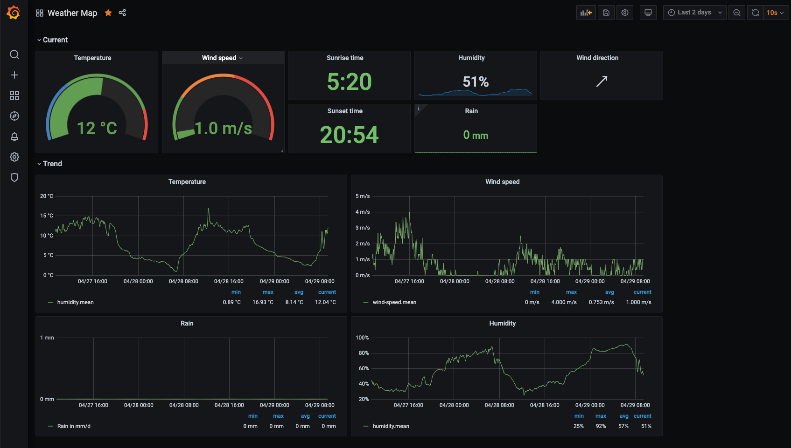
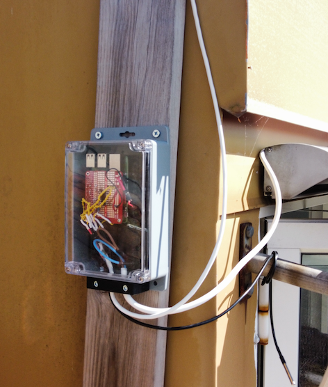
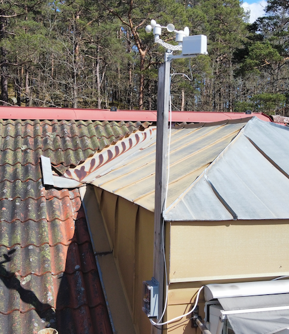

# Balena Weather

A weather station based on the Raspberry Pi project [Build your own weather station](https://projects.raspberrypi.org/en/projects/build-your-own-weather-station), implemented as a [Balena](https://www.balena.io/) multi container application.

Raspberry Pi 3                                | Weather station  
:--------------------------------------------:|:-------------------------:
  |  

## Hardware

* Raspberry Pi 3
* [Prototyping HAT for Raspberry Pi](https://www.robotshop.com/en/prototyping-hat-raspberry-pi-b-2ba3b.html)  
* [Sparkfun Weather Meter Kit](https://www.sparkfun.com/products/15901)
* One MCP3008 (8-Channel 10-Bit ADC With SPI Interface)   
* [SHT-30](https://www.adafruit.com/product/4099) humidity/temperature sensor
* Waterproof [DS18B20](https://www.amazon.com/Eiechip-Waterproof-Temperature-Thermometer-Resistance/dp/B07MB1J43W/) temperature sensor
* Two 4.7k resistors

## Components

The application is built using the following container and sensors:

### Sensor containers

* [Anemometer](./anemometer/README.md) - Anemometer (wind speed) sensor of the weather station.
* [Humidity](./humidity/README.md) - Humidity and temperature sensor SHT-30.
* [Raingauge](./raingauge/README.md) - Raingauge sensor of the weather station.
* [Temperature](/temperature/README.md) - Additional DS18B20 temperature sensor.
* [Windvane](/windvane/README.md) - Windvane sensor of the weather station.

### Message queue and database

* [Mqtt](./mqtt/README.md) - [Eclipse Mosquitto](https://hub.docker.com/r/arm64v8/eclipse-mosquitto) container which acts as message broker to which all sensors are sending their data.
  The Telegraf container reads from the Mosquitto queue and pushes the metrics into InfluxDB.
* [Telegraf](./telegraf/README.md) - Part of the [TIG](https://hackmd.io/@lnu-iot/tig-stack) stack to consume and display sensor data.
* InfluxDB - Time series database storing the sensor data. 
  This is the storage component of the [TIG](https://hackmd.io/@lnu-iot/tig-stack) stack.
  It uses a default [InfluxDB DockerHub image](https://hub.docker.com/_/influxdb).

### UI and API

* [NGINX](./nginx)
* [API](./api/README.md) - the simplest of all containers in the weather applications.
  A Ruby based [Sinatra](http://sinatrarb.com) used for exposing REST APIs for the weather app.
  Also,one of the simplest Balena containers, since there is no sensor and no special configuration.
* [Grafana Dashboard](./dashboard/README.md) - the Grafana dashboard displaying all weather data.

## Wiring

The wiring of the main components of the weather station (anemometer, windvane and raingauge) is as per [Build your own weather station](https://projects.raspberrypi.org/en/projects/build-your-own-weather-station).

## Misc

### Powering via 5V rail

* [Raspberry Pi Fuse](https://www.petervis.com/Raspberry_PI/Raspberry_Pi_Dead/Raspberry_Pi_Fuse.html)
* [Power requirements of the Pi](https://raspberrypi.stackexchange.com/questions/51615/raspberry-pi-power-limitations)

### Other

* [Balena Masterclass](https://github.com/balena-io/balena-cli-masterclass/blob/master/README.md)
* [Sparkfun Weather Meter Kit Specs](https://cdn.sparkfun.com/assets/d/1/e/0/6/DS-15901-Weather_Meter.pdf)
* [Pinout](https://pinout.xyz/)
