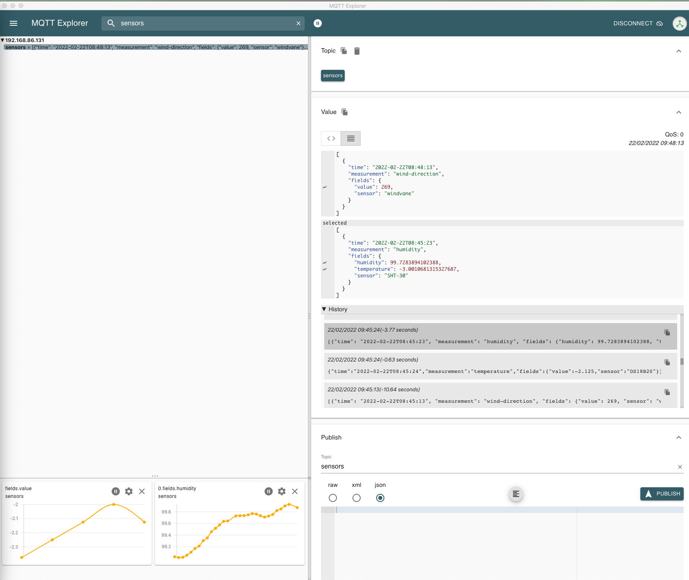

# Mosquitto

This container configures [Eclipse Mosquitto](https://github.com/eclipse/mosquitto) as a MQTT message broker sensors can send their data to.

Per default the MQTT server is unauthneticated, allowing any client to connect to send data.
It is recommended to use a username and password.
To do this set the device variables _MQTT_USER_ and _MQTT_PASSWORD_.

The Mosquitto is exposed to the outside via [nginx](../nginx/README.md).
If you don't have any external clients/sensors it is recommended to remove the nginx configuration.

While exposed via nginx, you can use [MQTT Explorer](http://mqtt-explorer.com/) to connect to Mosquitto.
This allows to debug and even plot the incoming sensor data.

